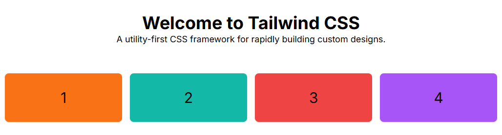
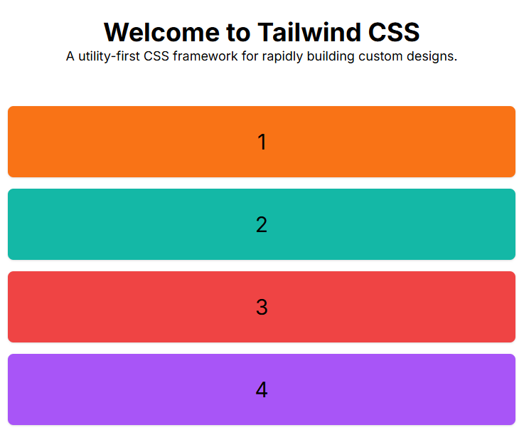
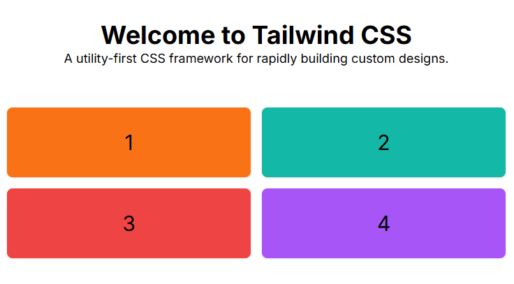
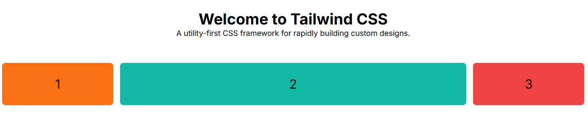
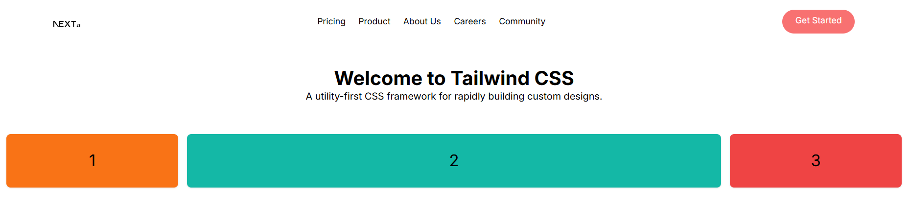

## Grid - Columns

- `grid md:grid-cols-4` : 4 columns on medium screens and above and 1 column on small screens

- `grid md:grid-cols-4 grid-cols-2` : 4 columns on medium screens and above and 2 columns on small screens

## Grid - Spanning

- Parent : `grid md:grid-cols-5`
- Child - 2 : `md:col-span-3`

## Responsive Navbar

